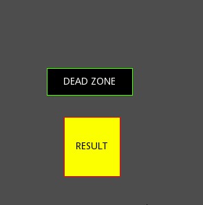
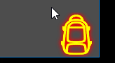

## 1. Подгонка элементов пользовательского интерфейса (окна, подсказки, меню), или любых других прямоугольных областей в размеры экрана
Функция описана в файле `MatchScreen.gd`.

Тестовый пример:
    Пример из игры:

## 2. Независящий от time_scale проигрыватель анимаций (AnimationPlayer)
Применяется для анимаций в реальном времени, если время игрового процесса изменено с помощью `Engine.time_scale`
Реализован в виде надстройки над стандартным AnimationPlayer, скрипт в файле `TimelessAnimationPlayer.gd`.
